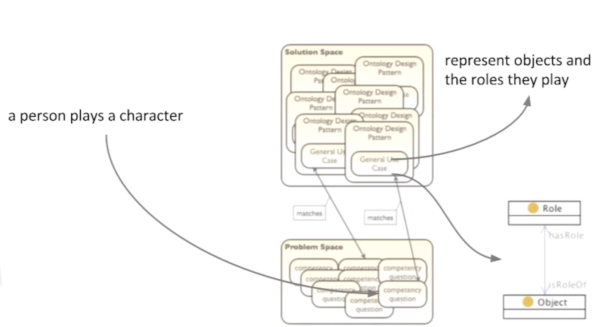

## [See the complete documentation on GitBook](https://krke.gitbook.io/krke-final-project-documentation-1/)

# 🧠 Modeling Cognitive Biases

The aim of our project is to model two clusters of biases taken from the classification made by Buster Benson, posted at this [link on Medium.](https://betterhumans.pub/cognitive-bias-cheat-sheet-55a472476b18)

A visualization of the cognitive bias cheat sheet has been provided by [John Manoogian III.](https://medium.com/@jm3)

 

The biases are grouped into 20 unique mental strategies that we use for specific reasons. These 20 clusters of biases are grouped by the general mental problems they attempt to address, which are: "What should we remember?"; "Too much information"; "Not enough meaning"; "Need to act fast."

In particular, we will focus on two clusters of biases, respectively from the two mental problems "Need to act fast" and "Not enough meaning."

They are:

**1. To avoid mistakes, we aim to preserve autonomy and group status and avoid irreversible decisions**

This includes:
**- Status quo bias**
**- Social comparison bias**
**- Decoy effect**
**- Reverse psychology**
**- Reactance**
**- System justification**

**2. We fill in characteristics from stereotypes, generalities, and prior histories**

This includes:
**- Group attribution error**
**- Ultimate atribution error**
**- Stereotyping**
**- Essentialism** 
**- Functional fixedness**
**- Moral credential effect**
**- Just-world hypothesis**
**- Argument from fallacy**
**- Authority bias**
**- Automation bias**
**- Bandwagon effect**
**- Placebo effect**

## 📚 Methodology

### Overview

Our ultimate objective is to model the biases outlined above and create an ontology for semantic web technologies using the iterative and pattern-based methodology known as **eXtreme Design (XD).**

As articulated in the paper "eXtreme Design with Content Ontology Design Patterns" authored by Valentina Presutti, Enrico Daga, Aldo Gangemi, and Eva Blomqvist: "With the name eXtreme Design (XD), we identify an approach, a family of methods, and associated tools, based on the application, exploitation, and definition of **Ontology Design Patterns (ODPs)** for solving ontology development issues." In a nutshell, XD represents an incremental, iterative method for pattern-based ontology design.

XD adopts the notion of an ontology project, characterized by two main sets: the *problem space*, encompassing the actual modeling issues referred to as *local problems*, that necessitate resolution during the project, and the *solution space*, which houses reusable modeling solutions.

ODPs are linked to Generic Use Cases (GUC) and constitute the ontology project's solution space, serving as the primary knowledge repository for addressing ontology design challenges, including reengineering, evaluation, construction, and more. On the other hand, the ontology project's problem space provides detailed descriptions of the actual issues known as "Local Use Cases" (LUC).

### Ontology Design Patterns

Before delving into the core principles and workflow of XD, it is essential to shed light on the methodology it is built upon: **Ontology Design Patterns** (Gangemi 2005)[1].

Adapted from a design concept originally conceived in architecture by Christopher Alexander, ODPs revolve around the notion of recurring modeling problems and offer a repertoire of flexible standard solutions. A "pattern" represents a solution tailored to a specific problem within a given context. Alexander's work, "A Pattern Language," elucidates this concept, stating: "The elements of this language are entities called patterns. Each pattern describes a problem that occurs over and over again in our environment and then describes the core of the solution to that problem, in such a way that you can use this solution a million times over, without ever doing it the same way twice."

Ontology Design Patterns provide compact, reusable (abstract) ontology templates accompanied by explicit documentation, stored in a searchable repository organized by **Competency Questions (CQs).** We distinguish between the following types:
**- Content Patterns:** Domain-dependent, language-independent.
**- Logical Patterns:** Domain-independent, related to representation languages.
**- Presentation Patterns:** Focus on the ontology from the user perspective, addressing aspects like naming conventions.
**- Transformation Patterns:** Offer guidance on how to convert an ontology into another representation language.

The two fundamental building blocks of the design principles are **Logical ODPs** and **Content ODPs (CPs).** The former tackle design problems independently of specific conceptualizations or domains, while the latter address design issues concerning the domain classes and properties that populate an ontology; they deal with content-related problems. These two components are interconnected since Content ODPs serve as instantiations of Logical ODPs (or compositions thereof).

In order to describe CPs, each one of them is associated with a *catalogue entry* that includes the following set of information fields:
- *Name:* Provides a name for the pattern.
- *Intent:* Describes the *Generic Use Case* addressed by the pattern.
- *Competency questions:* Contains examples of competency questions that the knowledge base associated with the CP needs to address.
- *Also Known as:* Provides other names (if any) by which the pattern is known.
- *Scenarios:* Provides examples of requirements, expressed in natural language, that can be modeled using the pattern.
- *Diagram:* Depicts a UML class diagram representing the pattern.
- *Elements:* Describes the elements (classes and relations) included in the pattern and their role within the pattern.
- *Consequences:* Provides a description of the benefits and/or possible trade-offs when using the patterns.
- *Known uses:* Gives examples of realistic ontologies where the pattern is used.
- *Extracted from/Reengineered from:* Provides the reference ontology/conceptual schema (if any) from which the pattern has been extracted/reused.
- *Related patterns:* Indicates other patterns (if any) that are either a specialization, generalization, composition, or component of the pattern being described.

CPs are reusable solutions to recurrent modeling problems, which have two components: a domain and a use case (or task). The same domain can have many use cases, and the same use case can be found in different domains. Ontologies are usually considered models for a domain, but their use case is usually unknown. As reusable solutions, CPs must explicitly encode both a domain and a use case. Since use cases are extremely diversified, a catalogue of CPs requires the notion of a "Generic Use Case" (GUC), i.e., a generalization of use cases that can be provided as examples for an issue of domain modeling. A GUC expresses a recurrent scenario in different domain ontology projects. The intuition underlying GUC hierarchies is based on a methodological observation: ontologies must be built out of domain tasks that can be captured by means of *competency questions*, which are typical queries that experts might want to submit to a knowledge base of their target domain for a certain task.

The process of selecting the right pattern involves identifying two components in our Content ODPs: the domain (where the application will work) and the requirements. The same domain can have many requirements, and the same requirement can be found in different domains. Therefore, both domain and requirements are elements that need to be represented in the content design pattern. A typical way of capturing requirements is through **competency questions**, which serve as the key to the design patterns we are seeking. Content ODPs are collected and described in catalogues and adhere to a common **presentation template**.

We try to provide an example.[2]
We want to model a fact like: *"Basil Rathbone played Sherlock Holmes in the 1939 movie 'The Hound of the Baskervilles'."*
So we want to model the fact that somebody is taking over a temporary role.
We need to analyze the sentence that contains the knowledge that need to be represented. We have to match what's is in the sentece with some kind of competency question about a person that plays a character.

In the "Problem Space" we have all the available competency questions, we need to map our basic sentence to a competency question that is about a person playing a character.
If we find one in our "Problem Space" usually we have mapping betweeen the competency questions and the Ontology Design Patterns that are in the "Solution Space". We select for example an ODPs that is described with "represent objects and roles they play" and if it fits to our purpose we can take over this ontology template for our ontology and then represent this fact exactly with the according Ontology Design Pattern.

We need a large repository where we can look for ODPs, the one we will use in our project is [Ontology Design Patterns](http://ontologydesignpatterns.org/).

### **eXtreme Design Principles and Tasks**

The principles of XD draw inspiration from those of the agile software methodology called eXtreme Programming (XP). The main idea behind agile software development is the ability to incorporate changes easily at any stage of the development process.[3] XD heavily relies on Content Ontology Design Patterns (CPs) and is based on modular design and collaboration. The main XD principles can be summarized as follows:

**- Customer Involvement and Feedback:** A key point is to formulate complete and correct assumptions about the domain we want to model. Domain experts should be involved from the start to facilitate the explicit expression of knowledge that is usually implicit in requirement documents, including competency questions.

**- Customer Stories, Competency Questions (CQs), and Contextual Statements:** The ontology requirements and tasks are described in terms of small stories by the customer representative. Designers work on these small stories and, together with the customer, transform them into the form of CQs and contextual statements. Contextual statements are accompanying assertions that explicitly state knowledge that is typically implicit in CQs. A CQ is a typical query that an expert might want to submit to a knowledge base of its target domain, for a certain task. It represents a specific requirement on an ontology or a part of an ontology (e.g., an ontology design pattern). Given certain inputs, the ontology, in conjunction with a reasoner, can answer the competency question. CQs and contextual statements will be used throughout the whole development process, and their definition is a key phase as designers face the challenge of helping the customer make explicit as much implicit knowledge as possible.

**- CP Reuse and Modular Design:** If there is a CP's Generic Use Case (GUC) that matches our Local Use Case (LUC), it has to be reused. For our project, we will use the design patterns collected on the [Ontology Design Patterns website.](http://ontologydesignpatterns.org/wiki/Ontology_Design_Patterns_._org_%28ODP%29)

The assumption is that there exist classes of problems that can be solved by applying common solutions, as experienced in software engineering. The aim is to support reusability on the design side, specifically. CPs are a very beneficial kind of pattern for ontology design because they provide solutions to domain-oriented problems and are directly reusable.

CPs encode conceptual, rather than logical design patterns. They propose patterns for solving design problems for the domain classes and properties that populate an ontology, addressing content problems. They have an explicit non-logical vocabulary for a specific domain of interest (i.e., they are content-dependent). CPs provide solutions to domain modeling problems and affect only the specific region of the ontology dealing with such domain modeling problems. They are typically reused by applying specialization, extension, and composition to them. In principle, CPs do not depend on any specific language; however, in order to reuse them as building blocks, they have to be implemented in some way.[4]

**- Collaboration and Integration:** Since the ontology is developed in a modular way, integration is a key aspect of XD. Collaboration and constant sharing of knowledge are needed in an XD setting, where similar or even the same CQs and sentences can be defined for different stories. When this happens, it is important, for example, that the same CP is reused.

**- Task-Oriented Design:** The focus of the design is on that part of the domain of knowledge under investigation that is needed to address the user stories and, more generally, the tasks that the ontology is expected to address. This is opposed to the more philosophical approach of formal ontology design, where the aim is to be comprehensive with respect to a certain domain.

**- Test-Driven Design:** Stories, CQs, and contextual statements are used to develop unit tests. A new story can be treated only when all unit tests associated with it have been passed. This aspect enforces the task-oriented approach of the method.

**- Pair Design:** The team of designers is organized in pairs. At least one pair is in charge of integrating ontology modules.

We will now describe the workflow of XD with CPs, organized in 12 steps (The XD iterative workflow).

 

**Task 1. Get into the project context.**
A group of designer and a group of domain experts (or costumer representative) identify together an overview of the problem, its scope, and initial terminology. The result of this task is a collaborative environment where domain experts and designers will share documentation and argument about modelling issues.

**Task 2. Collect requirement stories.**
The costumer is invited to write stories, possibly from real, documented scenarios, that samples the typical facts that should be stored in the resulting ontology. A story should includes the story's title, a list of other stories which it depends on, a description in natural language, and a priority value assigned by the designers based on the interaction with the costumer. Stories can be added by costumer/domain expert during the whole project life cycle.

**Task 3. Select a story that has not been treated yet.**
Each pair of designers selects a story that will be the focus of their work for the next iteration.

**Task 4. Transform the story into CQs.**
The pair process the story and from it derive a set of CQs. In order to do that, designers could involve the costumer for having feedback/clarifications. First the story is split into simple sentences, meaning that complex example sentences may be broken up into shorter sentences to increase clarity. The sentences are abstracted so that they describe a class of facts instead of a specific one. Additionally, contextual statements can be derived from the discussion with the costumer/domain expert.

E.g. *Rome is the capital of Italy, it is located in the Lazio region.*
The senteces can be generalized in: A city is the capital of a country. A city is located in a region.

CQs:
- What city is the capital of a certain country?
- In what region is a certain city located?
- In what country is a certain city located?

**Task 5. Select a CQ that has not been treated yet.** The iteration continues by selecting one of the CQs.

**Task 6. Match the CQ to GUCs.** 
This task has the aim of identifying candidate CPs based on the CQ, which express part of the LUC. The matching procedure can be done either with some tool support e.g., keyword based searching, or manually e.g., if the designers have a good knowledge of available CPs. We here assume that designer manually perform the matching against the ontologydesignpatterns.
org repository of CPs.

**Task 7. Select the CPs to reuse.**
The goal of this task is to select which of those patterns should be used for solving the modeling problem.

**Task 8. Reuse and integrate selected CPs.**
The term “reuse” here refers to the application of typical operation that can be applied to CPs i.e. import, specialization, and composition. The result of this task is an UML diagram.

This task can be divided in sub-tasks:

**Task 8.1.** Select a CP that has not been integrated yet.

**Task 8.2.** Specialization: Identify CP's entities to be specialized and create subclass and subproperty axioms.

**Task 8.3.** Composition: Identify CP's entities and axioms to be aligned with the module under development and align them.

Iterate over the sub-tasks until all CPs have benn integrated.

**Task 9. Test and fix.**
The goal of this task is to validate the resulting module with respect to the CQ just modeled. To this aim, the task is executed through the following steps: (i) the CQ is elaborated in order to derive a unit test, e.g. SPARQL query; (ii) the instance module is fed with sample facts based on the story; (iii) the unit test is ran against the ontology module. If the result is not the expected one i.e. the test is not passed, the module is revised in order to fix it, and the unit test ran again until the test is passed; (iv) run all other unit tests associated with the story so far until they all pass. Notice that all unit tests are described in dedicated wiki pages that are properly linked to the associated story. If all CQs associated to the story have been addressed, the pair can pass to Task 10, otherwise they “go back” to Task 5.

**Task 10. Release module.**
This task identifies the end of an iteration for a pair and its result is an ontology module. Once a whole story has been addressed, and the resulting module has been successfully tested, the new module can be released. The module is assigned with a URI and published in order to be shared by the whole team. If the module can be publicly shared, it can be published in
open Web repositories such as ontologydesignpatterns.org. The module is then passed to the pair in charge of the integration. The pair of designer selects a new story if there are still some unaddressed.

**Task 11. Integrate, test and fix.**
Once a new module is released, it has to be integrated with all the others that constitute the current version of the ontology. At least one pair is in charge of performing integration and related tests: new unit tests are defined for the integration, and all existing ones are again executed as regression tests before moving to next task. In this task, all contextual statements are taken into account and all necessary alignment axioms are defined. The module is now under the complete control and editing of the pair in charge of the integration. The products of this tasks are new unit tests
and alignment axioms, all properly documented in the wiki.

**Task 12. Release new version of the ontology.** Once all unit tests have been passed, a new version of the ontology can be released.

A tutorial that puts together XD and Pattern-based Ontology Design is provided at the following [link](http://ontologydesignpatterns.org/wiki/Training:EXtreme_Design_%28XD%29:_Pattern-based_Ontology_Design)

### **CLOWN Modeling framework**

The *CLOWN Modeling framework* is a framework that can be used in conjunction with the eXtreme Design (XD) methodology for ontology development. It provides a structured approach to modeling ontologies by incorporating various components. Let's break down the different components of the CLOWN Modeling framework:

**1. Context and Literature State of the Art:**
This component involves **understanding the context** and conducting a comprehensive review of the existing literature related to the domain you are working with. This step helps establish a solid foundation of knowledge and ensures that your ontology is aligned with current understanding and research in the field.

**2. Large Language Models:**
Large Language Models (LLMs) refer to powerful natural language processing models like GPT-3.5, which have the ability to generate human-like text. **LLMs can be leveraged to assist in ontology development** by providing suggestions, generating ontological elements, or aiding in the extraction of relevant information from textual sources.

**3. Ontology Design Patterns:**
Ontology Design Patterns (ODPs) are reusable modeling solutions for common ontology development challenges. ODPs capture best practices and provide a structured approach to representing specific concepts, relationships, or patterns within an ontology. **They help ensure consistency and interoperability across ontologies.**

**4. Words as Frame Semantic Triggers:**
This component suggests using words or terms as triggers for frame semantics. Frames refer to structured representations of knowledge that capture concepts, attributes, and relationships within a specific domain. By identifying specific words or terms, you can map them to corresponding frames and **create a more semantically rich ontology.**

**5. New Modules Integration and Alignment:**
This component focuses on **integrating newly created ontology modules** and aligning them with existing modules or ontologies. As you develop different parts of your ontology, it's important to ensure coherence and compatibility between the modules. This step facilitates the integration of new knowledge while maintaining consistency within the overall ontology structure.

## 🧗‍♂️ Workflow

**1.** Begin by familiarizing yourself with the context and conducting a literature review to gain a comprehensive understanding of the domain you are working with.

**2.** Harness the power of large language models to assist in ontology development, enabling you to generate suggestions and extract valuable information from textual sources.

**3.** Identify and leverage existing ontology design patterns (ODPs) that align with your specific modeling requirements. These patterns not only provide valuable guidance but also foster consistency throughout the ontology.

**4.** Pinpoint specific words or terms that can act as triggers for frame semantics. This enables you to map them effectively to relevant frames within your ontology.

**5.** Integrate the newly created ontology modules into the overall structure, ensuring seamless alignment and compatibility with existing modules or ontologies.

By incorporating the CLOWN Modeling framework into the XD methodology, you can benefit from a structured approach to ontology development that leverages existing knowledge, ontology design patterns, and semantic triggers, ultimately leading to a well-designed and coherent ontology. 🎯

## 🛠️ Tools

For reach our goal we will use the following technologies:

* ChatGPT:
https://chat.openai.com

* OWL 2:
https://www.w3.org/TR/owl2-syntax/#Ontologies

* Ontology Design Pattern:
http://ontologydesignpatterns.org

* Quokka Concepts:
http://etna.istc.cnr.it/quokka/concepts

* Quokka Frames:
http://etna.istc.cnr.it/quokka/frames

* FRED: 
http://wit.istc.cnr.it/stlab-tools/fred/demo/

* Framester:
https://framester.github.io/

* FrameNet:
https://framenet.icsi.berkeley.edu/

* Protégé:
https://protege.stanford.edu

# Glossary

## Axiom
An axiom, postulate, or assumption is a statement that is taken to be true, to serve as a premise or starting point for further reasoning and arguments. The word comes from the Ancient Greek word ἀξίωμα (axíōma), meaning 'that which is thought worthy or fit' or 'that which commends itself as evident'.

The precise definition varies across fields of study. In classic philosophy, an axiom is a statement that is so evident or well-established, that it is accepted without controversy or question.In modern logic, an axiom is a premise or starting point for reasoning.

In mathematics, an axiom may be a "logical axiom" or a "non-logical axiom". Logical axioms are taken to be true within the system of logic they define and are often shown in symbolic form (e.g., (A and B) implies A), while non-logical axioms (e.g., a + b = b + a) are substantive assertions about the elements of the domain of a specific mathematical theory, such as arithmetic.

Non-logical axioms may also be called "postulates" or "assumptions". In most cases, a non-logical axiom is simply a formal logical expression used in deduction to build a mathematical theory, and might or might not be self-evident in nature (e.g., the parallel postulate in Euclidean geometry). To axiomatize a system of knowledge is to show that its claims can be derived from a small, well-understood set of sentences (the axioms), and there are typically many ways to axiomatize a given mathematical domain.

Any axiom is a statement that serves as a starting point from which other statements are logically derived. Whether it is meaningful (and, if so, what it means) for an axiom to be "true" is a subject of debate in the philosophy of mathematics.

In onotology design axioms are assertions (including rules) in a logical form that together comprise the overall theory that the ontology describes in its domain of application. This definition differs from that of "axioms" in generative grammar and formal logic. In these disciplines, axioms include only statements asserted as a priori knowledge. As used here, "axioms" also include the theory derived from axiomatic statements.

In an OWL 2 ontology a set of axioms — statements that say what is true in the domain - is the main component. OWL 2 provides an extensive set of axioms, all of which extend the Axiom class in the structural specification. Axioms in OWL 2 can be declarations, axioms about classes, axioms about object or data properties, datatype definitions, keys, assertions (sometimes also called facts), and axioms about annotations.

## Frame Semantics
Frame semantics is a theory of linguistic meaning developed by Charles J. Fillmore that extends his earlier case grammar. It relates linguistic semantics to encyclopedic knowledge. The basic idea is that one cannot understand the meaning of a single word without access to all the essential knowledge that relates to that word. For example, one would not be able to understand the word "sell" without knowing anything about the situation of commercial transfer, which also involves, among other things, a seller, a buyer, goods, money, the relation between the money and the goods, the relations between the seller and the goods and the money, the relation between the buyer and the goods and the money and so on. Thus, a word activates, or evokes, a frame of semantic knowledge relating to the specific concept to which it refers (or highlights, in frame semantic terminology).

## Frame
Frames are an artificial intelligence data structure used to divide knowledge into substructures by representing "stereotyped situations". They were proposed by Marvin Minsky in his 1974 article "A Framework for Representing Knowledge". Frames are the primary data structure used in artificial intelligence frame languages; they are stored as ontologies of sets.

Frames are also an extensive part of knowledge representation and reasoning schemes. They were originally derived from semantic networks and are therefore part of structure-based knowledge representations. According to Russell and Norvig's "Artificial Intelligence: A Modern Approach", structural representations assemble "[...]facts about particular objects and event types and arrange the types into a large taxonomic hierarchy analogous to a biological taxonomy".

## Lexical unit
Lexical units (LU) are lemmas, with their part of speech, that evoke a specific frame. In other words, when an LU is identified in a sentence, that specific LU can be associated with its specific frame(s). For each frame, there may be many LUs associated to that frame, and also there may be many frames that share a specific LU, this is typically the case with LUs that have multiple word senses. Alongside the frame, each lexical unit is associated with specific frame elements by means of the annotated example sentences.

Example:

Lexical units that evoke the `Complaining` frame (or more specific perspectivized versions of it, to be precise), include the verbs "complain", "grouse", "lament", and others.

## Ontology Design Pattern (ODP)
An OP is a modeling solution to solve a recurrent ontology design problem. It is a template that represents a schema for specific design solutions. An ODP consists of a set of “prototypical” ontology entities that constitute the “abstract form” of a pattern, and of a set of metadata about its use cases, motivations, provenance, the pros and cons of its application, the links to other patterns, etc. Design solutions based on ODPs encode ontology entities that apply, specialize, or instantiate the prototypical entities defined by the schema.

## Content Ontology Design Pattern (CP)
CPs are distinguished networked ontologies and have their own namespace. They cover a specific set of competency questions (requirements), which represent the problem they provide a solution for. Furthermore, CPs show certain characteristics, i.e. they are: computational, small, autonomous, hierarchical, cognitively relevant, linguistically relevant, and best practices.

They show the following characteristics: CPs encode conceptual, rather than logical design patterns. In other words, while Logical OPs solve design problems independently of a particular conceptualization, CPs propose patterns for solving design problems for the domain classes and properties that populate an ontology, therefore addressing content problems. CPs are instantiations of Logical OPs (or of compositions of Logical OPs), featuring a non-empty signature. Hence, they have an explicit non-logical vocabulary for a specific domain of interest (i.e. they are content-dependent). CPs provide solutions to domain modeling problems and affect only the specific region of the ontology dealing with such domain modeling problems. They are typically reused by applying specialization, extension, and composition to them. In principle, CPs do not depend on any specific language, however in order to reuse them as building blocks, they have to be implemented in some way. In the portal *ontologydesignpatterns.org* we mainly deal with CPs in a Semantic Web context, hence we currently support OWL as a reference formalism for representation.

## Web Ontology Language (OWL)

Old OWL is based on description logic, a semantic fragment of first order logic, called SHOIN(D). OWL 2 is based on SROIQ(D) (extention of the old description logic). From now on we will refer to OWL 2

An OWL Ontology consists of:  classes / properties / individual (instances of classes).
Is based on an Open World Assumption -  the absence of information must not be valued as negative information - and No Unique Name Assumption - difference must be expressed explicitly.

### OWL Syntax Variants

OWL2 can be represented in different Syntax variants:
- Functional Syntax: substitutes abstract syntax of OWL1
- RDF/XML-Syntax: extension of existing OWL/RDF (for legacy reasons)
- OWL/XML-Syntax: indipendent XML serialisation
- Manchester-Syntax: machine readable syntax, especially used for ontology editors
- Turtle: concise and easy readable

## Open World Reasoning

In Open World Assumption the existence of further individuals is possible, if they are not explicitly excluded. The biggest single hurdle to understanding OWL and Description Logics is the use of Open World Reasoning. Almost certainly, all systems that newcomers to OWL will have encountered previously use closed world reasoning with “negation as failure” – i.e. if something cannot be found, it is assumed to be absent, e.g. databases, logic programming, constraint languages in frame systems, etc. By contrast, OWL uses open world reasoning with negation as unsatisfiability - i.e. something is false only if it can be proved to contradict other information in the ontology.

### References

[1] Gangemi, A. - Ontology design patterns for semantic web content. In The Semantic Web–ISWC 2005: 4th International Semantic Web Conference, ISWC 2005, Galway, Ireland, November 6-10, 2005. Proceedings 4 (pp. 262-276). Springer Berlin Heidelberg.

[2] OpenHPI Tutorials - Knowledge Engineering with Semantic Web Technologies, Dr. Harald Sack, Hasso Plattner Institute, University of Postdam [YouTube](https://www.youtube.com/playlist?list=PLoOmvuyo5UAcBXlhTti7kzetSsi1PpJGR).

[3] Presutti, V., Daga, E., Gangemi, A., & Blomqvist, E. (2009, October). eXtreme design with content ontology design patterns. In Proc. Workshop on Ontology Patterns (pp. 83-97).

[4] Gangemi A., Presutti V. Ontology Design Patterns, in Staab S. et al. (eds.): Handbook of Ontologies (2nd edition), Springer, 2009.