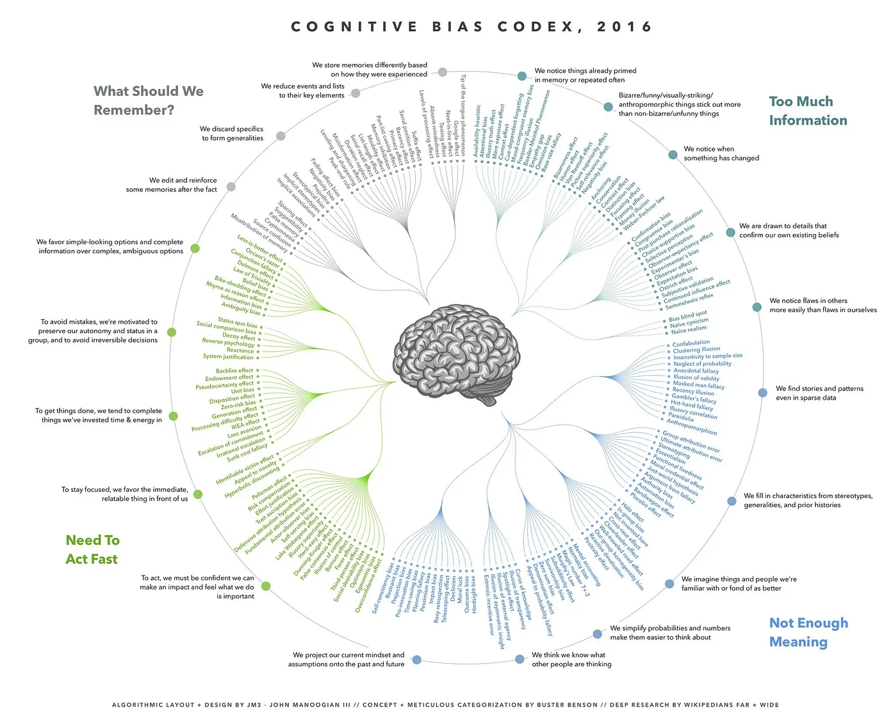
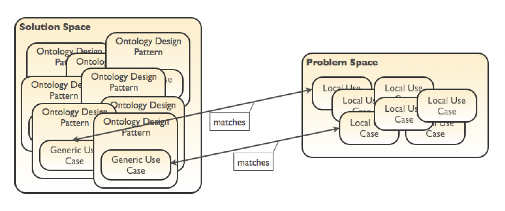
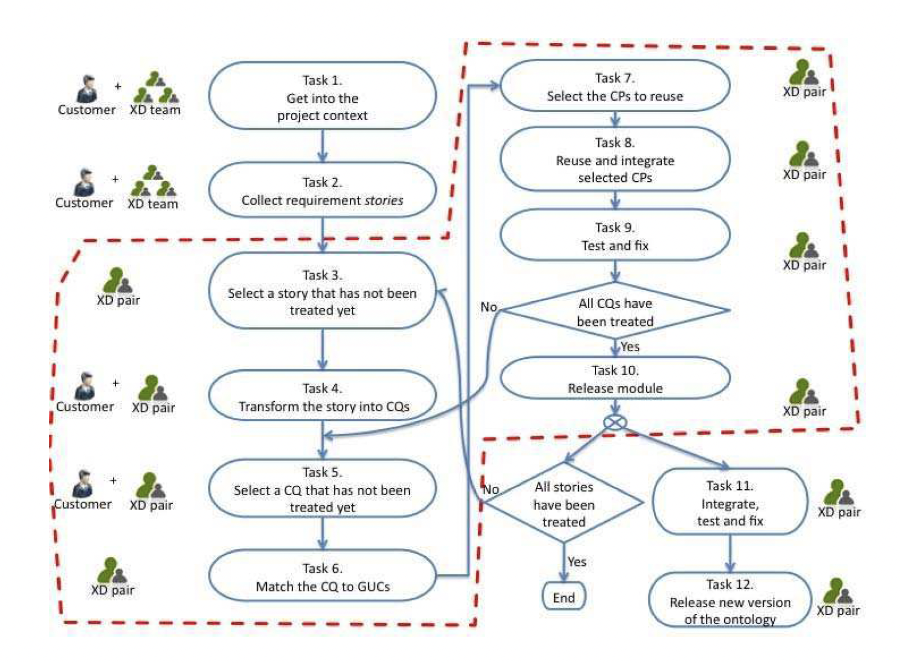

# 🧠 Modeling Cognitive Biases

The aim of our project is to model two biases taken from the classification made by Buster Benson, posted at this [link on Medium.](https://betterhumans.pub/cognitive-bias-cheat-sheet-55a472476b18)

A visualization of the cognitive bias cheat sheet has been provided by [John Manoogian III.](https://medium.com/@jm3)

 

The list is composed of 20 unique biased mental strategies that we use for specific reasons.
These 20 biases are gruoped by the general mental problem they attempt to address, which are: "What should we remember?"; "Too much information"; "Not enough meaning"; "Need to act fast".

In particular, we will focus on two biases respectly from the two mental problems "Need to act fast" and "Not enough meaning". They are:

1. **To avoid mistakes, we aim to preserve autonomy and group status and avoid irreversible decisions**

This includes:
- Status quo bias
- Social comparison bias
- Decoy effect
- Reverse psychology
- Reactance
- System justification

2. **We fill in characteristics from stereotypes, generalities, and prior histories**

This includes:
- Gruop attribution error
- Ultimate atribution  error
- Stereotyping
- Essentialism 
- Functional fixedness
- Moral credential effect
- Just-world hypothesis
- Argument from fallacy
- Authority bias
- Automation bias
- Bandwagon effect
- Placebo effect

## 📚 Methodology

### Overview
Our final goal is modeling the biases presented above and create an onology for semantic web technologies using a specific iterative method for pattern-based onoltogy design, called **eXtreme Design (XD).**

With the name eXtreme Design (XD), we identify an approach, a family of methods, and associated tools, based on the application, exploitation, and definition of **Ontology Design Patterns (ODPs)** for solving ontology development issues. XD is an incremental, iterative method for pattern-based
ontology development.

XD adopts the notion of ontology project, a development project characterized by two main sets: the "problem space", which is composed of the actual modeling issues, here referred to as the local problems, that have to be addressed during the project and the "solution space", which is made up of reusable modeling solutions.
ODPs are associated with Generic Use Cases (GUC) and compose the ontology project’s solution space, which is used as the main knowledge source for addressing ontology design issues e.g. reengineering, evaluation, construction, etc., the ontology project’s problem space provides descriptions of the actual issues called “Local Use Cases” (LUC).

### Ontology Design Patterns
Before exploring the main principles and workflow of XD, it is worthy to spend some words on the methodology on which it is build upon: **Ontology Design Patterns** (Gangemi 2005) -- TO  FIX: CITATION [Gangemi 2005](Gangemi, A. (2005). Ontology design patterns for semantic web content. In The Semantic Web–ISWC 2005: 4th International Semantic Web Conference, ISWC 2005, Galway, Ireland, November 6-10, 2005. Proceedings 4 (pp. 262-276). Springer Berlin Heidelberg.) --.

Adapting a design idea originally from architecture, introduced by Christopher Alexander, ODPs is based on the idea of recurring modeling problems and providing a set of adaptable standard solutions. A "pattern" is a solution to a problem in a given context. Originally described in "A Pattern Language" -- TO FIX: CITATION --, Alexander states that: "The elements of this language are entities called patterns. Each pattern describes a problem that occurs over and over again in our environment, and then describes the core of the solution to that problem, in such a way that you can use this solution a million times over, without ever doing the same way twice."
Ontology Design Patterns provide small reusable (abstract) ontology templates with explicit documentation, stored in a searchable repository ordered by **competence questions.**
We distinguish:
**- Content Patterns.** Domain dependent, language independent.
**- Logical Patterns.** Domain independent, related to representation language.
**- Presentation Patterns.** Ontology from user perspective, as e.g. naming conventions.
**- Transformation Patterns** How to transform an ontology in another representation language.

The two basic design principles building blocks are **Logical ODPs** and **Content ODPs (CPs).** The former solve design problems indipendently of a particular conceptualization or domain, while the latter, are patterns for solving design problems for the domain classes and properties that populate an ontology; they address content problems. They are connected since Content ODPs are instantiations of Logical ODPs (or compositions of Logical ODPs).

In order to describe CPs, each one of them is associated with a *catalogue entry* including the following set of information fields.
*Name* provides a name for the pattern; *Intent* descrives the *Generic Use Case* addressed by the pattern; *Competency questions* contains examples of competency questions that the knowledge base associared with the CP needs to address; *Also Known as* provides other names (if any) with which the pattern id known; *Scenarios* provides examples of requirements, expressed in natural language, chich can be modeled by using the pattern; *Diagram* depicts a UML class diagram representing the patterrn; *Elements* describes the elements (classes and relations) included in the pattern, and their role within the pattern; *Consequences* provides a description of the benefits and/or possible trade-offs when using the patterns; *Known uses* gives examples of realistic ontologies where the pattern is used, *Extracted from/Reengineered from* provides the reference ontology/conceptual schema (if any), from which  the pattern has been  extracted/reused; *Related patterns* indicates other patterns  (if any) that are either a *specialization, generalization, composition,* or *component* of the pattern being described.

CPs are reusable solutions to recurrent modelling problems, these problems have two components: a domain and a use case (or task). A same domain can have many use cases, and a same use case can be found in different domains.
Ontologies are usually considered models for a domain, but their use case is usually unknown. As reusable solutions, CPs must explicitly encode both a domain and a use case. Since use cases are extremely diversified, a catalogue of CPs requires the notion of a “Generic Use Case” (GUC), i.e. a generalization of use cases that can be provided as examples for an issue of domain modelling.
A GUC is the expression of a recurrent scenario in different domain ontology projects.
The intuition underlying GUC hierarchies is based on a methodological
observation: ontologies must be built out of domain tasks that can be captured
by means of *competency questions*. A competency question is a typical
query that an expert might want to submit to a knowledge base of its target
domain, for a certain task.

How we select the right pattern? Trying to summarize, usually if we try to model a problem, we have two components in our Content ODPs, we have first the domain (where this application really will work) and, on the other hand, the requirements. The same domain can have many requirements and the same requirement can be found in different domains. So domain and requirements are things that are somehow to be representet for your content design pattern. A typical way of capturing requirements is by mean of **competency questions**, that are the key to your design patterns we are looking for. Content ODPs are collected and described in catalogues and comply to a common **presentation template**.

We try to provide an example.
We want to model a fact like: *"Basil Rathbone played Sherlock Holmes in the 1939 movie 'The Hound of the Baskervilles'."*
So we want to model the fact that somebody is taking over a temporary role.
We need to analyze the sentence that contains the knowledge that need to be represented. We have to match what's is in the sentece with some kind of competence question about a person that plays a character.
In the "Problem Space" we have all the available competency questions, we need to map our basic sentence to a competency questions that is about a person playing a character.
If we find one in our "Problem Space" usually we have mapping betweeen the competency questions and the Ontology Design Patterns that are in the "Solution Space". We select for example an ODPs that is described with "represent objects and roles they play" and if it fits to our purpose we can take over this ontology template for our ontology and then represent this fact exactly with the according Ontology Design Pattern.

We need a large repository where we can look for ODPs, the one we will use in our project is [Ontology Design Patterns](http://ontologydesignpatterns.org/)

### **eXtreme Design principles and tasks**

XD principles are inspired by those of the agile software methodology called eXtreme Programming (XP). The main idea of agile software development is to be able to incorporate changes easily, in any stage of the development. [Presutti V., Daga E., Gangemi A., Blomqvist E. - eXtreme Design with Content Ontology Design Patterns - Semantic Technology Laboratory, ISTC_CNR] -- TO FIX: CITATION -- The method make intesive use of Content Ontology Design Patterns (CPs) and its principles are based on modular design and collaboration. Main XD principles can be summarized as follow:

**- Costumer involvement and feedback.** A key point is to formulate complete and correct assumptions on the domain we want to model. Domain experts should be involved from the start in order to favoring the explicit expression of knowledge that is usually implicit in requirement documents, including competency questions.

**- Costumer stories, Competency Questions (CQs), and contextual statements.** The ontology requirements and its tasks are described in terms of small stories by the costumer representative. Designers work on those small stories and, together with the costumer, transform them in the form of CQs and contextual statements. Contestual statements are accompanyning assertions that wxplicit knowledge that is typically implicit in CQs. A CQ is a typical query that an expert might want to submit to a knowledge base of its target domain, for a certain task. It is a specific requirement on an ontology or a part of an ontology (e.g. an ontology design pattern). Given certain inputs, the ontology in conjunction with a reasoner can answer the competency question. CQs and contextual statements will be used through the whole development, and their definition is a key phase as the designers have the challenge to help the costumer in making explicit as much implicit knowledge as possible.

**- CP reuse and modular design.** If there is a CP's Generic Use Case (GUC) that matches our Local Use Case (LUC) it has to be reused. For ou project we will use the design patterns collected in the [Ontology Design Patterns web site.](http://ontologydesignpatterns.org/wiki/Ontology_Design_Patterns_._org_%28ODP%29)
Under the assumption that there exist classes of problems that can be  solved by applying common solutions (as it has been experienced in software engineering), the aim is to support reusability on the design side specifically. CPs are a very beneficial kind of pattern for ontology design, because they provide solutions to domain-oriented problems, and are directly reusable.
CPs encode conceptual, rather than logical design patterns. They propose patterns for solving design problems for the domain classes and properties that populate an ontology, addressing content problems. They have an explicit non-logical vocabulary for a specific domain of interest (i.e. they are content-dependent). CPs provide solutions to domain modelling problems and affect only the specific region of the ontology dealing with such domain modelling problems. They are typically reused by applying specialization, extension, and composition to them. In principle, CPs do not depend on any specific language, however in order to reuse them as building blocks, they have to be implemented in some way. [1](Gangemi A., Presutti V. Ontology Design Patterns, in Staab S. et al. (eds.): Handbook of Ontologies (2nd edition), Springer, 2009.)

**- Collaboration and Integration.** Since the ontology is developed in a modular way, integration is a key aspect of XD. Collaboration and constant sharing of knowledge is needed in a XD setting, in fact similar or even the same CQs and sentences can be defined for different stories. When this happens, it is important e.g. that the same CP is reused.

**- Task-oriented design.** The focus of the design is on that part of the domain of knowledge under investigation that is needed in order to address the user stories, and more generally, the tasks that the ontology is expected to address. This is opposed to the more philosophical approach of formal ontology design where the aim is to be comprehensive with respect to a certain domain.

**- Test-driven design.** Stories, CQs, and contextual statements are used in order to develop unit tests. A new story can be treated only when all unit tests associated with it have been passed. This aspect enforces the task-oriented approach of the method.

**- Pair design.** The team of designers is organized in pairs. At least one pair is in charge of integrating ontology modules.

### **eXtreme Design iterative workflow:**

We will now describe the workflow of XD with CPs, organized in 12 steps (The XD iterative workflow).

 

**Task 1. Get into the project context.**
A group of designer and a gruop of domain experts (or costumer representative) identify together an overview of the problem, its scope, adn initial terminology. The result of this task is a collaborative environment where domain experts and designers will share documentation and argument about modelling issues.

**Task 2. Collect requirement stories.**
The costumer is invited to write stories, possibly from real, documented scenarios, that samples the typical facts that should be stored in the resulting ontology. A story should includes the story's title, a list of other stories which it depends on, a description in natural language, and a priority value assigned by the designers based on the interaction  with the costumer. Stories can be added by costumer/domain expert during the whole project life cycle.

**Task 3. Select a story that has not been treated yet.**
Each pair of designers selects a story that will be the focus of their work for the next iteration.

**Task 4. Transform the story into CQs.**
The pair process the story and from it derive a set of CQs. In order to do that, designers could involve the costumer for having feedback/clarifications. First the story is split into simple sentences, meaning that complex example sentences may be broken up into shorter sentences to increase clarity. The sentences are abstracted so that they describe a class of facts instead of a specific one. Additionally, contextual statements can be derived from the discussion with the costumer/domain expert.

E.g. Rome is the capital of Italy, it is located in the Lazio region.
The senteces can be generalized in: A city is the capital of a country. A city is located in a region.

CQs:
- What city is the capital of a certain country?
- In what region is a certain city located?
- In what country is a certain city located?

**Task 5. Select a CQ that has not been treated yet.** The iteration continues by selecting one of the CQs.

**Task 6. Match the CQ to GUCs.** 
This task has the aim of identifying candidate CPs based on the CQ, which express part of the LUC. The matching procedure can be done either with some tool support e.g., keyword based searching, or manually e.g., if the designers have a good knowledge of available CPs. We here assume that designer manually perform the matching against the ontologydesignpatterns.
org repository of CPs.

**Task 7. Select the CPs to reuse.**
The goal of this task is to select which of those patterns should be used for solving the modeling problem.

**Task 8. Reuse and integrate selected CPs.**
The term “reuse” here refers to the application of typical operation that can be applied to CPs i.e. import, specialization, and composition. The result of this task is an UML diagram.
This task can be divided in sub-tasks:
Task 8.1. Select a CP that has not been integrated yet.
Task 8.2. Specialization: Identify CP's entities to be specialized and create subclass and subproperty axioms.
Task 8.3. Composition: Identify CP's entities and axioms to be aligned with the module under development and align them.
Iterate over the sub-tasks until all CPs have benn integrated.

**Task 9. Test and fix.**
The goal of this task is to validate the resulting module with respect to the CQ just modeled. To this aim, the task is executed through the following steps: (i) the CQ is elaborated in order to derive a unit test e.g., SPARQL query; (ii) the instance module is fed with sample facts based on the story; (iii) the unit test is ran against the ontology module. If the result is not the expected one i.e. the test is not passed, the module is revised in order to fix it, and the unit test ran again until the test is passed; (iv) run all other unit tests associated with the story so far until they all pass. Notice that all unit tests are described in dedicated wiki pages that are properly linked to the associated story. If all CQs associated to the story have been addressed, the pair can pass to Task 10, otherwise they “go back” to Task 5.

**Task 10. Release module.**
This task identifies the end of an iteration for a pair and its result is an ontology module. Once a whole story has been addressed, and the resulting module has been successfully tested, the new module can be released. The module is assigned with a URI and published in order to be shared by the whole team. If the module can be publicly shared, it can be published in
open Web repositories such as ontologydesignpatterns.org. The module is then passed to the pair in charge of the integration. The pair of designer selects a new story if there are still some unaddressed.

**Task 11. Integrate, test and fix.**
Once a new module is released, it has to be integrated with all the others that constitute the current version of the ontology. At least one pair is in charge of performing integration and related tests: new unit tests are defined for the integration, and all existing ones are again executed as regression tests before moving to next task. In this task, all contextual statements are taken into account and all necessary alignment axioms are defined. The module is now under the complete control and editing of the pair in charge of the integration. The products of this tasks are new unit tests
and alignment axioms, all properly documented in the wiki.

**Task 12. Release new version of the ontology.** Once all unit tests have been passed, a new version of the ontology can be released.

A tutorial that puts together XD and Pattern-based Ontology Design is provided at the following [link](http://ontologydesignpatterns.org/wiki/Training:EXtreme_Design_%28XD%29:_Pattern-based_Ontology_Design)

### **CLOWN Modeling framework**

The CLOWN Modeling framework is a framework that can be used in conjunction with the eXtreme Design (XD) methodology for ontology development. It provides a structured approach to modeling ontologies by incorporating various components. Let's break down the different components of the CLOWN Modeling framework:

1. Context and Literature State of the Art:
This component involves understanding the context and conducting a comprehensive review of the existing literature related to the domain you are working with. This step helps establish a solid foundation of knowledge and ensures that your ontology is aligned with current understanding and research in the field.

2. Large Language Models:
Large Language Models (LLMs) refer to powerful natural language processing models like GPT-3.5, which have the ability to generate human-like text. LLMs can be leveraged to assist in ontology development by providing suggestions, generating ontological elements, or aiding in the extraction of relevant information from textual sources.

3. Ontology Design Patterns:
Ontology Design Patterns (ODPs) are reusable modeling solutions for common ontology development challenges. ODPs capture best practices and provide a structured approach to representing specific concepts, relationships, or patterns within an ontology. They help ensure consistency and interoperability across ontologies.

4. Words as Frame Semantic Triggers:
This component suggests using words or terms as triggers for frame semantics. Frames refer to structured representations of knowledge that capture concepts, attributes, and relationships within a specific domain. By identifying specific words or terms, you can map them to corresponding frames and create a more semantically rich ontology.

5. New Modules Integration and Alignment:
This component focuses on integrating newly created ontology modules and aligning them with existing modules or ontologies. As you develop different parts of your ontology, it's important to ensure coherence and compatibility between the modules. This step facilitates the integration of new knowledge while maintaining consistency within the overall ontology structure.

## 🧗‍♂️ Workflow

1. Start by familiarizing with the context and conducting a literature review to understand the domain we are working with.

2. Leverage large language models to assist in ontology development, such as generating suggestions or extracting relevant information from textual sources.

3. Identify and utilize existing ontology design patterns (ODPs) that align with your modeling requirements. These patterns provide guidance and promote consistency.

4. Identify specific words or terms that can serve as triggers for frame semantics, allowing us to map them to relevant frames within your ontology.

5. Integrate newly created ontology modules into the overall structure and ensure alignment and compatibility with existing modules or ontologies.

By incorporating the CLOWN Modeling framework into the XD methodology, we can benefit from a structured approach to ontology development that leverages existing knowledge, ontology design patterns, and semantic triggers, ultimately leading to a well-designed and coherent ontology.

## 🛠️ Tools

For reach our goal we will use the following technologies:

* ChatGPT:
https://chat.openai.com

* Ontology Design Pattern:
http://ontologydesignpatterns.org

* Quokka Concepts:
http://etna.istc.cnr.it/quokka/concepts

* Quokka Frames:
http://etna.istc.cnr.it/quokka/frames

* FRED: 
http://wit.istc.cnr.it/stlab-tools/fred/demo/

* Framester endpoint:
http://etna.istc.cnr.it/framester2/sparql

* Protégé:
https://protege.stanford.edu